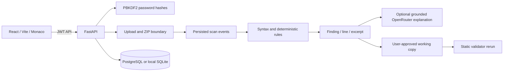

# CodeReview AI

CodeReview AI is an upload-first source review product for students. A user can paste code, upload one file, upload multiple files, or upload a ZIP project; the backend then validates input boundaries, parses supported syntax, runs deterministic rules, explains supported evidence, and opens a controlled fix workspace.

The product does not connect to source hosts or editors, and it never executes submitted code on the application host.

## Complete workflow

1. Register or sign in.
2. Create or select a project.
3. Paste code, upload a source file, choose multiple files, or upload a ZIP.
4. Watch backend-generated processing events for validation, parsing, static rules, ranking, explanation, and completion.
5. Inspect findings beside exact source lines.
6. Generate a fix proposal, preview the before/after code, and explicitly apply it to a working copy.
7. Re-run deterministic validators against the working copy.
8. Download the reviewed file or ZIP artifact.

## Supported inputs

Python, JavaScript, JSX, TypeScript, TSX, Java, HTML, CSS, JSON, YAML, and ZIP archives containing those formats.

Input enforcement:

- 500 KB per source file
- 10 MB submitted/expanded project limit
- 250 supported source files per project
- UTF-8 text only; binary files are rejected
- traversal paths and absolute paths are rejected
- dependency/build folders such as `node_modules`, `dist`, `.git`, virtual environments, and `vendor` are ignored

## Architecture



`OpenRouter` is optional. Without a key, the backend returns deterministic, evidence-grounded explanations. Secret-shaped values are redacted from finding responses and model prompts.

## Repository structure

```text
CodeReview-AI/
  frontend/       React application and workstation UI
  backend/        FastAPI API, ingestion service, and analysis engine
  examples/       Representative files and sample_project.zip
  docker-compose.yml
  .env.example
```

## Local setup

1. Copy `.env.example` to `.env` and set a unique `JWT_SECRET`.
2. Install backend dependencies: `python -m pip install -r backend/requirements.txt`.
3. Start the API from `backend`: `python -m uvicorn app.main:app --reload`.
4. Install frontend dependencies from `frontend`: `npm install`.
5. Start the client: `npm run dev`.
6. Open `http://localhost:5173`, create an account, and start a review.

SQLite is the zero-configuration default. Set `DATABASE_URL` to a PostgreSQL connection string for a hosted environment. Set `FRONTEND_URL` to the exact client origin used by CORS.

## Primary API routes

- Auth: `POST /api/v1/auth/register`, `POST /api/v1/auth/login`, `GET /api/v1/auth/me`
- Projects: `GET|POST /api/v1/projects`
- Queue a pasted/single-file scan: `POST /api/v1/scans/start`
- Queue multiple files or a ZIP: `POST /api/v1/import/project/start`
- Progress: `GET /api/v1/scans/{id}/status`, `/events`, `/events/stream`
- Results: `GET /api/v1/scans/{id}`, `/findings`
- Fixes: `POST /api/v1/findings/{id}/generate-fix`, `POST /api/v1/fixes/{id}/apply`
- Verification: `POST /api/v1/scans/{id}/verify`
- Download: `GET /api/v1/scans/{id}/reviewed-file`
- Decisions and audit: `POST /api/v1/findings/{id}/{action}`, `GET /api/v1/audit`

## Validation

- Backend: `python -m pytest -q` from `backend`
- Frontend production build: `npm run build` from `frontend`

The automated backend suite covers auth ownership, queued progress, secret redaction, a real finding, fix preview/application, working-copy verification, artifact download, Python syntax line reporting, and ZIP traversal rejection.

## Honest limitations

- Static validators do not prove runtime exploitability or correctness.
- Submitted programs and their test suites are not executed because no isolated sandbox is bundled with this repository.
- Automatic changes are offered only for deterministic patterns; ambiguous findings remain guided manual remediation.
- The lightweight JavaScript, TypeScript, Java, and CSS syntax checks validate delimiter structure and selected high-confidence rules; they are not replacements for each language's compiler or full ecosystem linter.
